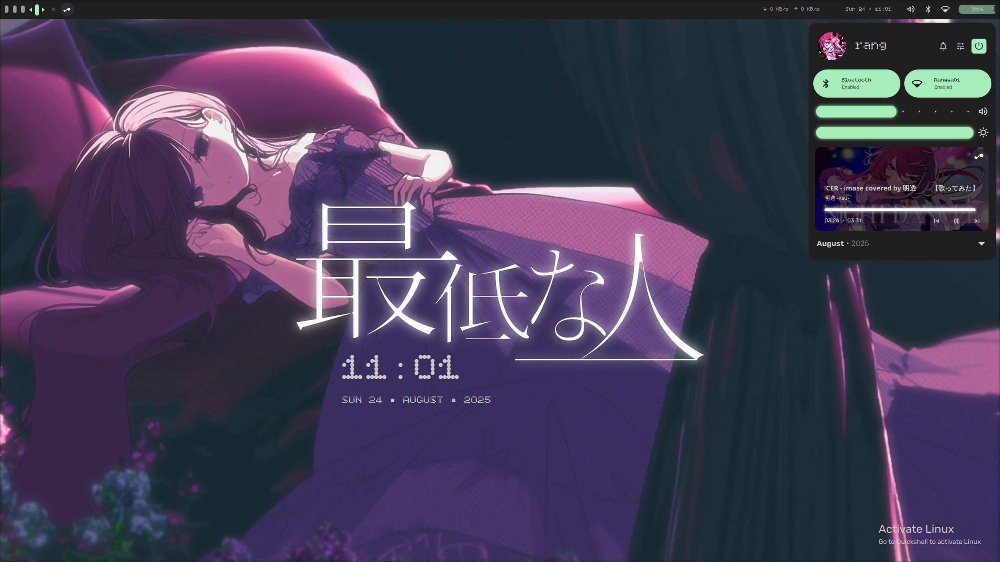
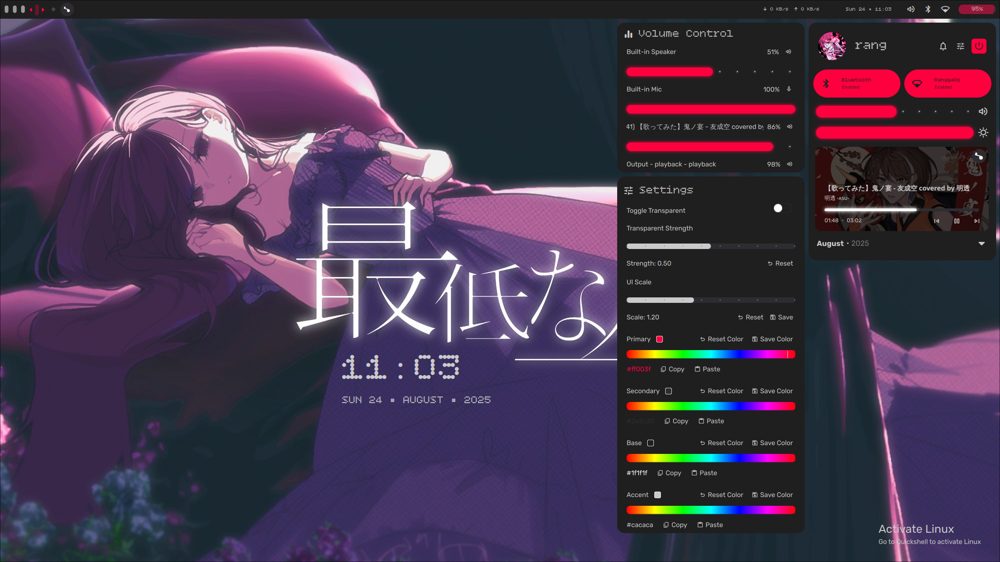
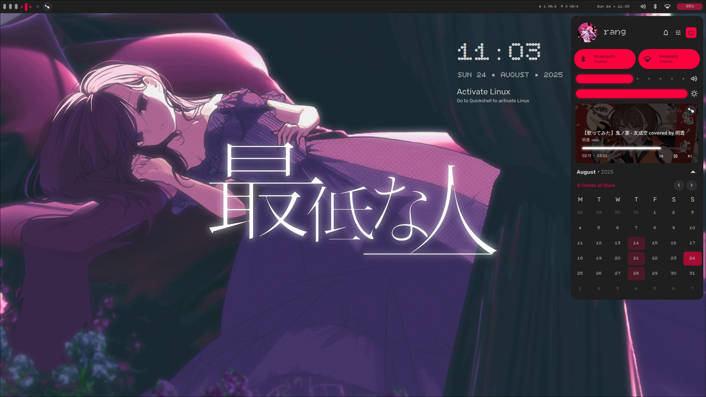

# Clairova Shell



<details>
  <summary>More Examples</summary>

  

</details>

<details>
  <summary>Another Examples</summary>
  
  

</details>


**Clairova Shell** is a fully customized dotfiles setup built with [Quickshell](https://quickshell.org/), designed to deliver a clean, minimal, and responsive shell experience. It includes interactive panels, notification systems, volume/brightness controls, and a stylish sidebar—all styled with a modern aesthetic and smooth animations.

Wallpapers: [Lecter3D | 
『 最低な人 』/ Kiss of death](https://x.com/Lecter3D/status/1941094390300311856/photo/1)

## Download

Requirements to install:

Playerctl - [Install here](https://archlinux.org/packages/extra/x86_64/playerctl/)

Brightnessctl - [Install here](https://archlinux.org/packages/extra/x86_64/brightnessctl/)

Plasma Browser Integration - [Install here](https://community.kde.org/Plasma/Browser_Integration)

Material Symbols & Icons - [Instal here](https://fonts.google.com/download?family=Material+Symbols+Outlined|Material+Symbols+Rounded|Material+Symbols+Sharp)

Rubik font - [Install here](https://fonts.google.com/specimen/Rubik)

Bitcount Single - [Install here](https://fonts.google.com/specimen/Bitcount+Single)

To change lockscreen wallpaper is:
```
Put your wallpaper in ~/Pictures/Wallpapers/ and save as Wallpaper.jpg
```
### Arch Linux Installation - Coming Soon
