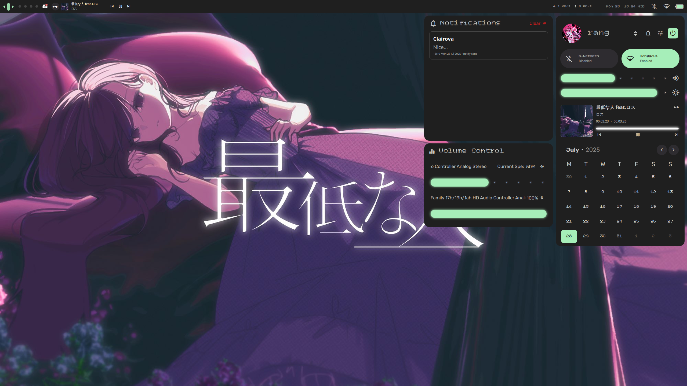

# Clairova Shell

**Clairova Shell** is a fully customized dotfiles setup built with [Quickshell](https://quickshell.org/), designed to deliver a clean, minimal, and responsive shell experience. It includes interactive panels, notification systems, volume/brightness controls, and a stylish sidebar—all styled with a modern aesthetic and smooth animations.

### ✨ Features

- Responsive and adaptive shell bar
- Elegant notification popup system
- Sidebar with controls for volume, brightness, and appearance
- Smooth animated transitions
- Modular and maintainable code
- Configurations stored as portable dotfiles
